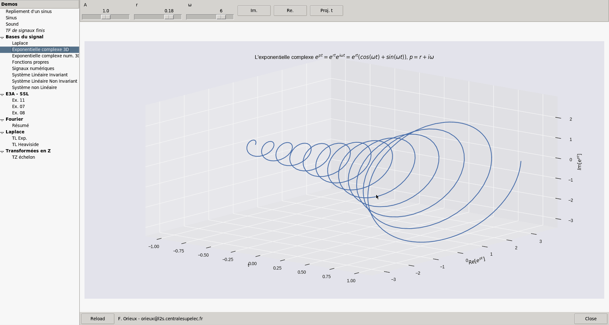

# About

This is the repository of a small application I made to teach with simple
interactive demonstrations.

The objectives are

- Simple API.

- Automatic creation of GUI control.

- No specific knowledge to create a new demonstration except python itself.

- Author is fully in charge of the demonstration code.

- Presentation in the classroom.

Looks the `demos` directory.

# Installation

The software is in unstable state and in development. At this time, I made it
for *my* needs only.

1. Clone the repository.
2. Install [poetry](https://python-poetry.org/).
3. In the root directory run `poetry install` to install dependencies.

After that you just have to launch it with `poetry run python3 teachapp.py`

# Authors

If you want to contribute, email me. If you use it, please cite me I, and link
to that page.

I'm François Orieux (http://pro.orieux.fr), an assistant professor,
Paris-Saclay University, in Laboratoire des Signaux et Systèmes.

# TODO

- Clean codebase and repository.

Long term

- win and osx support
- octave or matlab support
- web frontend (based on jupyter I suppose)
